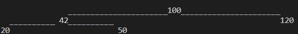

<h3> Running the tests and the main files </h3>

 From the root file -> problem folder run make build, then from src run make run in order to run the contents of the main.c file. If you want to run the tests for the 1st and 3rd problem from the problem folder directily run make test.   
Another way to run the main.c files is to simply use make single-run in the problem folder.

<h3> Fun Time Sorting </h3>

Used algorithm: heapsort  
Complexity for both time and space: O(NlogN), where N is the number of elements in the array.

<h3> Happy Print </h3>

Space Complexity: O(2^h), where h = the height of the binary tree. This comes from the fact that for each level we need 2^level nodes in the queue, of they are not present we include a dummy node.
Time Complexity: O(2^h) - for the same reason as stated above, we always need to keep track of the missing nodes when printing in order to have the right shape for the binary tree.

Prints a binary tree in a nice way:

Example:

<h3> Next Permutation </h3>

Time Complexity: O(N)  - linear runtime
Space Complexity: O(1) - space needed for the solution does not depend on the input size 

0. At each step we start from the last element and work our way to the first
1. Find firstIndex such that array[i] < array[i+1]
2. Find the secondIndex such that array[firstIndex] < array[i]
3. Swap elements on position firstIndex and secondIndex
4. Reverse all the elements to the right of firstIndex
